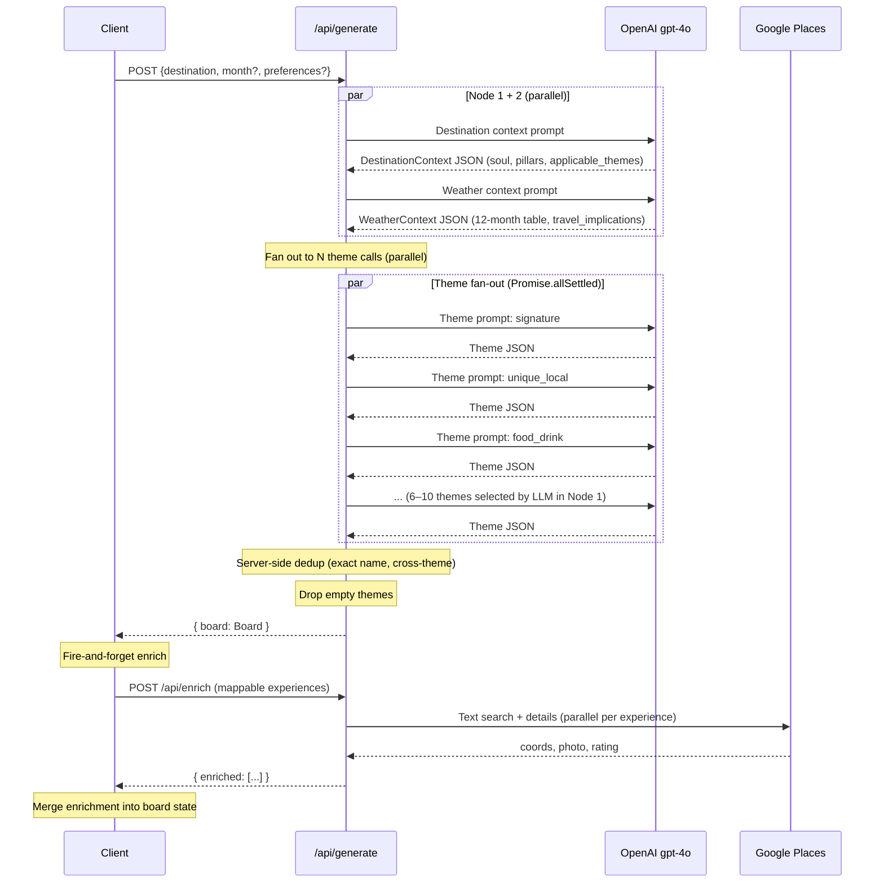

# TravelGPT — Architecture

**Version:** 0.4 · **Status:** Phase 2 shipped

---

## Phase Status

```
Phase 1.0  ──►  Phase 1.1  ──►  Phase 2  ──►  Phase 2.5  ──►  Phase 3
LLM only        + Google         + UI           Prompt           Itinerary
                  Places         ✅ SHIPPED      quality          planning
                  ✅ SHIPPED      on Vercel       pass 🔜          🔜
```

---

## System Overview (As Shipped)

```
Browser (Next.js client)
    │
    ├── POST /api/generate  ──► OpenAI gpt-4o (4-node fan-out)
    │                                └─► Board JSON (themes + experiences)
    │
    ├── POST /api/enrich  ───► Google Places API (parallel, fire-and-forget)
    │                                └─► Enriched coords, photos, ratings
    │
    └── GET /api/places-photo  ─► Google Places (photo proxy, key stays server-side)

localStorage: shortlist (liked / dismissed per experience ID)
Vercel: deployment target, auto-deploys from GitHub main
```

---

## Directory Structure (As Built)

```
Travel_GPT_V2/
├── ARCHITECTURE.md
├── PRODUCT_SPEC.md
├── .gitignore
└── app/                          # Next.js application root
    ├── app/
    │   ├── page.tsx              # Root page — full state machine (welcome→input→loading→board)
    │   ├── layout.tsx
    │   └── api/
    │       ├── generate/
    │       │   └── route.ts      # POST /api/generate — 4-node LLM fan-out
    │       ├── enrich/
    │       │   └── route.ts      # POST /api/enrich — Google Places enrichment
    │       └── places-photo/
    │           └── route.ts      # GET /api/places-photo — photo proxy
    ├── components/
    │   ├── welcome/
    │   │   └── WelcomeScreen.tsx
    │   ├── input/
    │   │   └── InputForm.tsx     # Compact + full-size variants
    │   ├── board/
    │   │   ├── ThemeSection.tsx  # Accordion row + horizontal card tray
    │   │   ├── ExperienceCard.tsx
    │   │   ├── ExperienceDetail.tsx  # Slide-in drawer
    │   │   ├── SpiritView.tsx    # Destination soul / pillars / honest notes
    │   │   └── WeatherTable.tsx  # 12-month climate table
    │   └── map/
    │       ├── MapView.tsx       # Google Maps with muted style + pin markers
    │       └── MapErrorBoundary.tsx
    ├── lib/
    │   ├── types.ts              # Board, Theme, Experience, DestinationContext, WeatherContext
    │   ├── shortlist.ts          # localStorage shortlist helpers
    │   ├── llm/
    │   │   └── client.ts         # callLLM() — wraps OpenAI + Anthropic SDKs
    │   ├── claude/
    │   │   └── prompts.ts        # Prompt builder functions
    │   └── places/
    │       └── client.ts         # Google Places API wrapper
    ├── prompts/
    │   ├── system.md             # Core curator persona + rules + schema
    │   ├── destination-context.md
    │   ├── weather-context.md
    │   └── themes/               # One .md per theme (signature, food_drink, etc.)
    └── .env.local                # OPENAI_API_KEY, ANTHROPIC_API_KEY, GOOGLE_PLACES_API_KEY,
                                  # NEXT_PUBLIC_GOOGLE_MAPS_KEY
```

---

## Generate Route — 4-Node Fan-Out

`POST /api/generate` — `maxDuration: 180s` (Vercel Pro)



### Theme call output per node

Each theme call returns:
```json
{
  "id": "signature",
  "name": "Signature Experiences",
  "description": "One sentence for this theme at this destination.",
  "experiences": [ ...5–10 experience objects... ]
}
```

---

## Cross-Theme De-duplication

Theme calls run in parallel — no experience can be passed between them. Two-layer fix:

**Layer 1 — Prompt instruction (`system.md`):**
> "Each experience must appear in at most one theme. You will be given a list of experiences already assigned to other themes — never repeat them."

*(Note: the "list" is aspirational — we don't yet pass the list since calls are parallel. This instruction still reduces repetition by priming the LLM.)*

**Layer 2 — Server-side post-processing (in `route.ts`):**
After all theme calls complete, iterate themes in the order they were returned:
- Maintain `seenIds: Set<string>` and `seenNames: Set<string>`
- For each experience: if `id.toLowerCase()` or `name.trim().toLowerCase()` already seen → drop it
- Drop any theme that becomes empty after filtering

This uses exact name matching (not aggressive stripping), so "Pike Place Market" and "Pike Place Market Fish Throw" are treated as distinct.

---

## Enrich Route

`POST /api/enrich` — called client-side, fire-and-forget

For each mappable experience (is_mappable: true):
1. Text Search: `"{name}, {destination}"` → place_id
2. Place Details: photos, rating, review_count, coordinates, maps_url
3. Photo URL proxied through `/api/places-photo` (keeps API key server-side)

Enrichment is best-effort — if Places returns no match, `places_enrichment` stays null. Card still renders.

After enrich completes, client merges results into board state via functional `setBoard` update. Open detail drawer is also updated if the enriched experience is currently selected.

---

## UI State Machine (`app/page.tsx`)

```
Stage:  welcome → input → loading → board
Tab:             (board only) experiences | spirit | weather | map
```

State:
- `board: Board | null` — full board including enrichment (updated reactively)
- `shortlist: Shortlist` — `{ [id]: 'liked' | 'dismissed' }` — persisted to localStorage
- `selected: Experience | null` — drives the detail drawer

---

## Map Architecture

**Library:** `@vis.gl/react-google-maps`
**Marker type:** `Marker` (legacy — allows custom `styles` prop on Map without needing a Cloud Console mapId)
**Pin rendering:** SVG data URI circles — white (default), rose (liked), dark (active)
**Map style:** Silver/muted — POIs and transit suppressed so pins are visible
**InfoWindow:** Shown on pin click with photo, name, theme, learn-more link, like/dismiss actions

Failure handling:
- `gm_authFailure` global callback → sets error state → shows "Map unavailable" message
- `MapErrorBoundary` class component catches React render errors from the Maps library

---

## Tech Stack

| Layer | Choice | Notes |
|---|---|---|
| Framework | Next.js 16 App Router | Single repo API + UI; Vercel deployment |
| Primary LLM | OpenAI `gpt-4o` | Default provider; `16384` max output tokens |
| Secondary LLM | Anthropic `claude-sonnet-4-6` | Available via `provider: "anthropic"` param |
| Prompt caching | Anthropic only | System prompt cached via `cache_control: ephemeral` when using Anthropic |
| Places | Google Places API (New) | Text Search + Place Details; photo proxy on server |
| Maps | Google Maps JS API | Via `@vis.gl/react-google-maps` |
| Styling | Tailwind CSS | Stone palette; rose for liked state |
| State | React useState + localStorage | No server-side state in Phase 2 |
| Deployment | Vercel | Auto-deploy on push to `main` |

---

## Environment Variables

```bash
# .env.local (local dev) + Vercel environment (production)
OPENAI_API_KEY=                    # Required — primary LLM
ANTHROPIC_API_KEY=                 # Optional — alternative LLM
GOOGLE_PLACES_API_KEY=             # Required for /api/enrich and /api/places-photo
NEXT_PUBLIC_GOOGLE_MAPS_KEY=       # Required for MapView (client-side)
```

---

## Phase 2.5 — Prompt Quality Pass (Next)

### Goal
Improve the accuracy and usefulness of what the LLM returns — specifically: better location specificity (for map quality), better destination classification (for theme relevance), and tighter card quality.

### location_hint accuracy

**Problem:** Vague `location_hint` values (e.g., "Higashiyama district") cause Places Text Search to return low-confidence matches or miss entirely, leaving pins off the map.

**Fix:**
1. Tighten `location_hint` rule in `system.md` — must be the actual name of a specific place (temple, market, street, viewpoint), never a neighborhood or district
2. Add confidence filtering in `/api/enrich` — if Places match score is below threshold, return `places_enrichment: null` instead of attaching a wrong pin
3. (Stretch) Add a "location rewrite" step: if `location_hint` looks like an area description, run a second LLM call to convert it to the best specific named place

### Destination type classification

**Problem:** Region-level destinations ("Pacific Northwest", "Tuscany", "Greek Islands") spread experiences across too large a geography, hurting map coherence and card specificity.

**Fix:**
1. In the destination context prompt (Node 1), output a `destination_type` field: `city | island | region | national_park | neighborhood`
2. Use `destination_type` to:
   - Warn the user if they entered a region (suggest picking a base city)
   - Adjust which themes are applicable (region → emphasize day_trips; neighborhood → drop day_trips)
   - Adjust the `location_hint` specificity instruction per type

### Theme relevance

**Problem:** Some themes are applied where they produce weak cards (e.g., "Hiking" for an urban destination produces "walk through a park" level cards that undermine credibility).

**Fix:**
- Add destination-type-aware examples to each per-theme prompt file
- In the destination context prompt, add minimum-quality guidance: only include a theme if at least 4 genuinely strong experiences exist for it at this destination

---

## Phase 3 — Itinerary Planning

### New endpoint

```
POST /api/plan
{
  "destination": string,
  "experiences": Experience[],    // liked experiences from board
  "duration_days": number,
  "base_area": string             // e.g. "Gion district, Kyoto" — for geography grouping
}
```

Returns:
```json
{
  "days": [
    {
      "day": 1,
      "label": "Eastern Kyoto — Temples & Higashiyama",
      "theme": "Walking distance, ~4km",
      "experiences": [...ordered Experience list...],
      "notes": "Strenuous day — temple stairs throughout. Start by 7:30am."
    }
  ]
}
```

### LLM task

Given the liked experiences (with coordinates, effort, duration, best_time already known), ask the LLM to:
1. Group experiences into days by geographic proximity (minimize travel between stops)
2. Order within each day by best_time (morning → afternoon → evening)
3. Respect effort distribution (don't stack all strenuous experiences on day 1)
4. Fit within `duration_days` — surface a warning if liked count exceeds what's realistic
5. Add a day label and practical notes per day

### New UI

- **Itinerary tab** added to board (5th tab: Spirit / Weather / Experiences / Map / Itinerary)
- Tab is grayed out until ≥ 3 experiences are liked
- On click: triggers `/api/plan`, shows loading state, then renders day cards
- Each day card: ordered list of experiences with time estimate + travel note to next stop
- **"Plan my trip →"** button in the liked count chip in the header (replaces "♥ N saved" chip once count ≥ 3)

### Data flow

```
User likes experiences  →  shortlist in localStorage
User clicks "Plan my trip"
    → POST /api/plan with liked experiences + duration_days
    → LLM groups + orders → ItineraryDay[]
    → Render day cards in Itinerary tab
```

No persistence in Phase 3 — itinerary lives in component state. Phase 4 adds saving.

---

## Phase 4 — Persistence (Later)

Adds Supabase PostgreSQL + Auth. Out of scope until Phase 3 is validated.

- Board caching (avoid re-calling LLM for same destination)
- User accounts (magic link auth)
- Saved trips and itineraries
- Shareable links
- Preference profiles across devices

---

## Key Risks (Updated)

| Risk | Status | Mitigation |
|---|---|---|
| LLM output doesn't match schema | Managed | `parseJSON` strips markdown fences; theme calls use `Promise.allSettled` so one failure doesn't block others |
| Cross-theme experience repetition | Managed | Server-side exact-name dedup after all theme calls complete |
| Generic output feels like ChatGPT | Active risk | Phase 2.5 prompt quality pass — main lever is specificity rules in per-theme prompts |
| location_hint too vague for Places | Active risk | Phase 2.5 — tighten prompt rule + confidence threshold in enrich |
| Latency too high (>45s) | Acceptable | Fan-out parallelism keeps it manageable; streaming is a Phase 2.5 option if needed |
| Places API finds wrong match | Accepted | Returns null enrichment; card still renders without pin |
| Maps JS API not enabled | Handled | `gm_authFailure` callback + `MapErrorBoundary` show friendly error |
