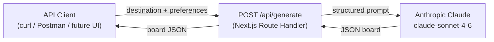
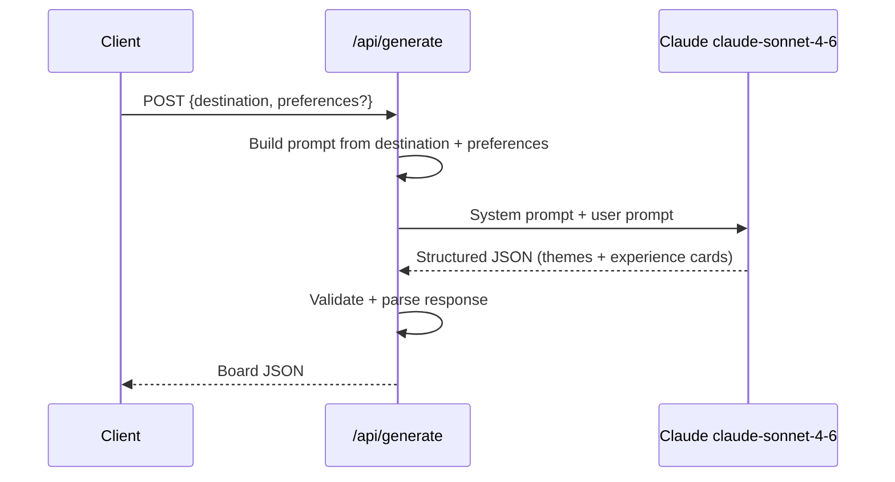
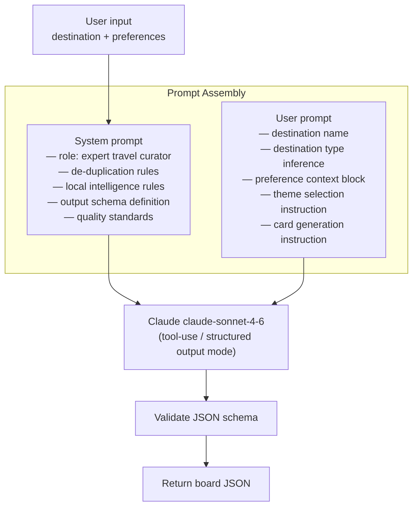
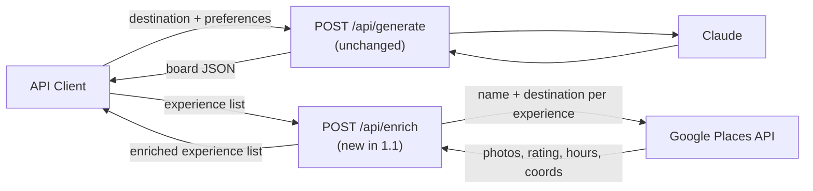
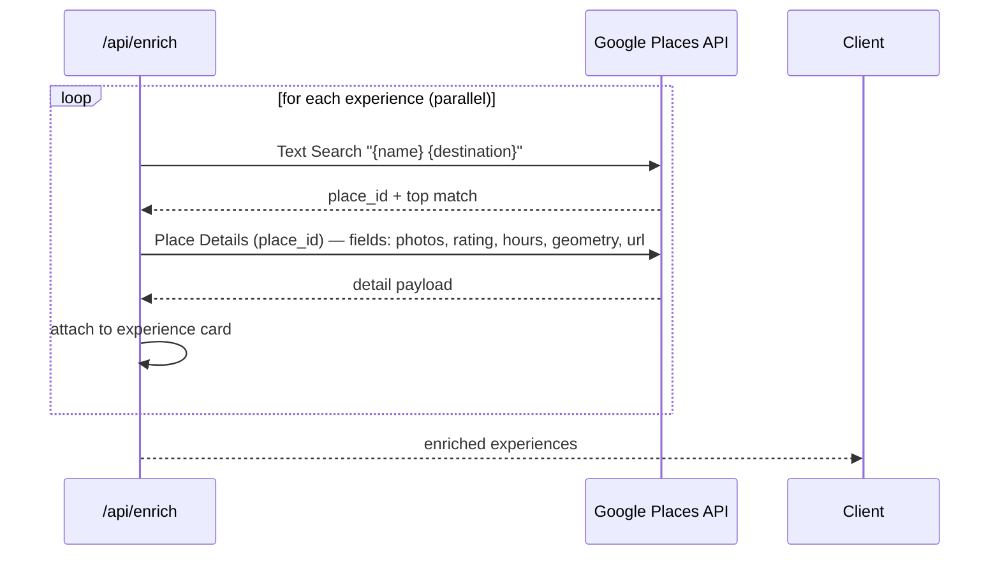
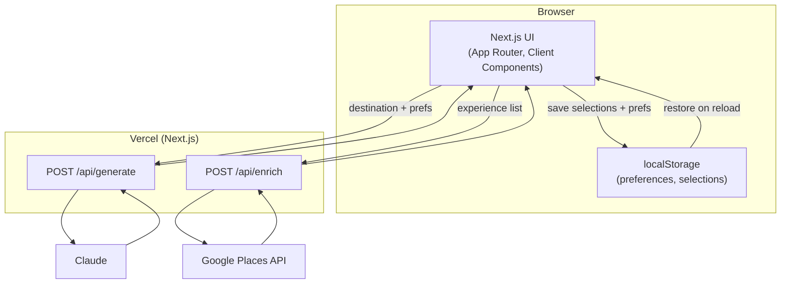
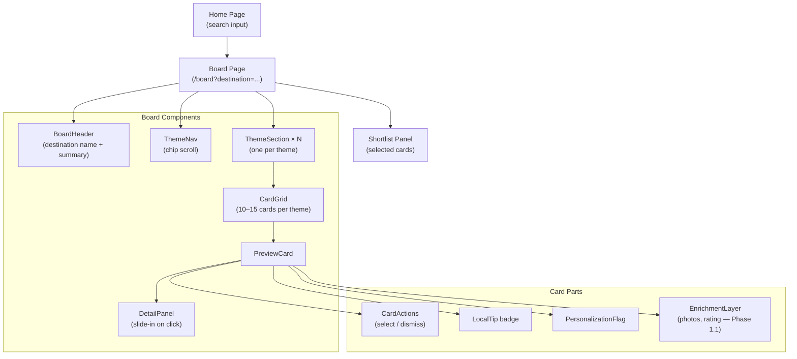
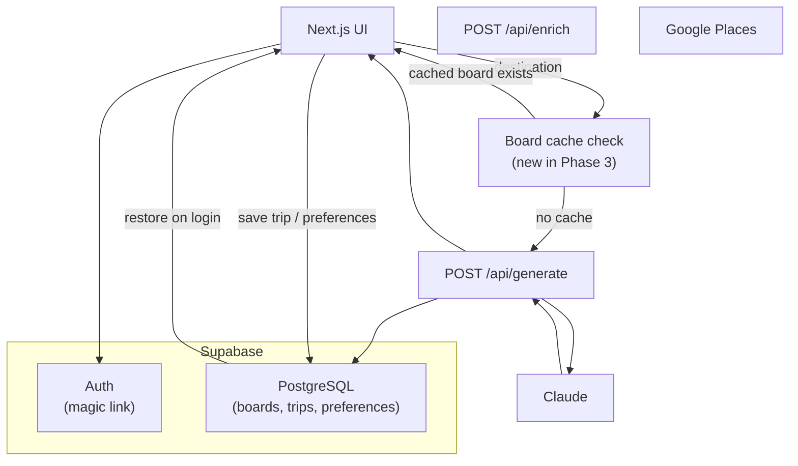

# TravelGPT — Architecture

---

## Phasing at a Glance

```
Phase 1.0  ──►  Phase 1.1  ──►  Phase 2  ──►  Phase 3
LLM only        + Google         + UI           + Database
                  Places
```

Each phase is strictly additive. Later phases do not require rewriting earlier ones.

---

## Phase 1.0 — System Architecture

No database. No external search. One API endpoint. One call to Claude.



---

## Phase 1.0 — Request Flow



**Target latency:** 5–15 seconds for a full board. Acceptable for alpha. Streaming added in Phase 2 if needed.

---

## Phase 1.0 — Prompt Pipeline

The quality of the product in Phase 1.0 lives entirely in the prompt design.



### Prompt responsibilities

**System prompt (cached — same for every request):**
- Role definition: expert travel curator, not a generic AI assistant
- De-duplication rule: one card per underlying experience, never per operator
- Local intelligence rule: tips must be specific and actionable, not generic
- Output schema with field definitions and types
- Quality floor: if Claude cannot generate a confident, specific card, omit it rather than padding

**User prompt (built per request):**
- Destination name and inferred type (city / island / national park / region)
- Formatted preference block when provided
- Instruction to select 6–10 relevant themes for this destination type
- Instruction to generate 10–15 cards per theme in ranked order
- Instruction to populate `personalization_note` for any card that conflicts with preferences

---

## Phase 1.1 — Adding Google Places Grounding

Phase 1.1 adds one new endpoint. The `/api/generate` endpoint is unchanged.



### Enrichment flow per experience card



Cards where Places returns no confident match get `places_enrichment: null`. They remain on the board — enrichment is additive, not required.

---

## Phase 2 — Stateless UI

Phase 2 adds a Next.js frontend. The backend is unchanged.



### UI component structure



**Client state (localStorage only, no server):**
- User preferences
- Per-experience selection status (selected / dismissed / none)

---

## Phase 3 — Persistence

Phase 3 introduces Supabase. The API and UI from earlier phases are unchanged.



**What Phase 3 adds:**
- Board caching (generated boards stored so Claude is not re-called on repeat visits)
- User accounts (magic link auth)
- Saved trips and shortlists
- Preference profiles across devices
- Shareable shortlist links
- Historical trip archive

The database schema for Phase 3 is designed but not built until Phases 1 and 2 are validated.

---

## Directory Structure (Phase 1.0)

```
travel-gpt/
├── app/
│   └── api/
│       ├── generate/
│       │   └── route.ts        # POST /api/generate
│       └── enrich/
│           └── route.ts        # POST /api/enrich (Phase 1.1)
├── lib/
│   ├── claude/
│   │   ├── client.ts           # Anthropic SDK setup
│   │   ├── prompts.ts          # System prompt + user prompt builders
│   │   └── schema.ts           # Output JSON schema definition
│   ├── places/
│   │   └── client.ts           # Google Places API wrapper (Phase 1.1)
│   └── types.ts                # Shared TypeScript types (Board, Theme, Experience)
└── .env.local
    # ANTHROPIC_API_KEY
    # GOOGLE_PLACES_API_KEY     (Phase 1.1)
```

Phase 2 adds `app/` pages and `components/`. Phase 3 adds `lib/supabase/` and `supabase/migrations/`.

---

## Tech Decisions

| Decision | Choice | Reason |
|---|---|---|
| Framework | Next.js 14 App Router | Single repo for API + UI; simple deployment |
| AI model | claude-sonnet-4-6 | Strong structured output, large context window, prompt caching |
| Structured output | Claude tool-use mode | Guarantees JSON schema compliance on every call |
| Prompt caching | System prompt cached | System prompt is identical across all requests — ~40% token savings |
| Web research | None in Phase 1.0 | Claude's embedded knowledge is sufficient for destination discovery |
| Places grounding | Google Places API | Industry standard; best photo + review coverage; Phase 1.1 |
| Database | None until Phase 3 | Avoids premature complexity; validate product first |
| Deployment | Vercel | Zero-config Next.js |

---

## Key Risks

| Risk | Mitigation |
|---|---|
| Claude output doesn't match schema | Use tool-use / structured output mode; validate on server before returning |
| Generic output feels like ChatGPT | Prompt design is the whole product in Phase 1.0 — invest here first |
| Latency too high (15s+ response) | Add streaming in Phase 2; for Phase 1.0 it is acceptable |
| Places API finds wrong match | Confidence threshold on Places match; fall back to `null` enrichment |
| Knowledge cutoff misses recent changes | Phase 1.1 Places grounding catches closures/hours; acceptable trade-off for 1.0 |
